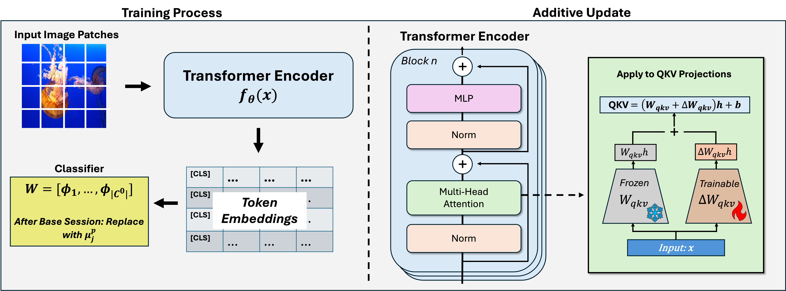

# Paper Title: 
Adaptive Additive Parameter Updates of Vision Transformers for Few-Shot Continual Learning 

# Abstract:
Integrating new class information without losing previously acquired knowledge remains a central challenge in artificial intelligence, often referred to as catastrophic forgetting. Few-shot class incremental learning (FSCIL) addresses this by first training a model on a robust dataset of base classes and then incrementally adapting it in successive sessions using only a few labeled examples per novel class. However, this approach is prone to overfitting on the limited new data, which can compromise overall performance and exacerbate forgetting. In this work, we propose a simple yet effective novel FSCIL framework that leverages a frozen Vision Transformer (ViT) backbone augmented with parameter-efficient additive updates. Our approach freezes the pre-trained ViT parameters and selectively injects trainable weights into the self-attention modules via an additive update mechanism. This design updates only a small subset of parameters to accommodate new classes without sacrificing the representations learned during the base session. By fine-tuning a limited number of parameters, our method preserves the generalizable features in the frozen ViT while reducing the risk of overfitting. Furthermore, as most parameters remain fixed, the model avoids overwriting previously learned knowledge when small novel data batches are introduced. Extensive experiments on benchmark datasets demonstrate that our approach yields state-of-the-art performance compared to baseline FSCIL methods.

# Datasets

# Script
